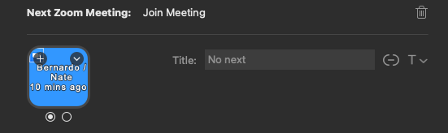

# Join Next Zoom Meeting Plugin

This is a plugin that automatically joins your next zoom meeting. I am an
engineering manager, so naturally 90% of my time is spent on Zoom. Being able to
join my next meeting at the click of a button is key to my day-to-day.

### Prerequisites

1. Your calendar events synced via Apple Calendar
2. The first time the plugin executes, it will say that Elgato is trying to
   access Apple Calendar

### Future Development

Eventually, I want to add configurability for how far into the future this
looks (default: 5min), and maybe resolution for double booking.

### Example of joinable meeting:

